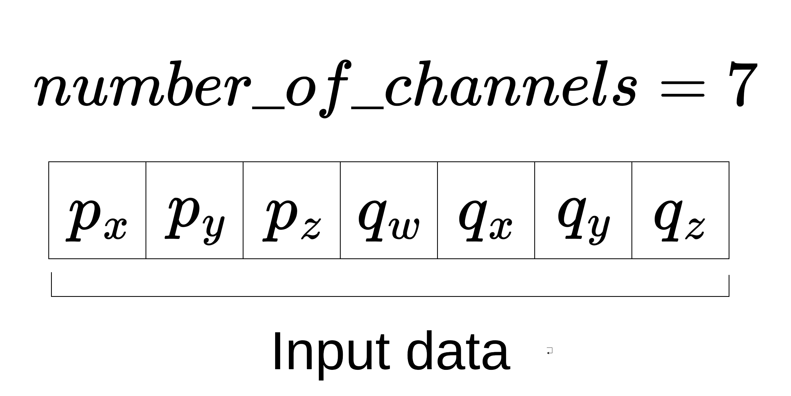

# moving_average_poses_filter

In this package, the `MovingAveragePosesFilter` class is provided, extending the `filters::MultiChannelFilterBase` base class of the [filters](https://github.com/ros/filters/tree/ros2) ROS2 package.

Such class is a modified version of the [`MultiChannelMovingAverageFilter`](../multi_channel_moving_average_filter/include/multi_channel_moving_average_filter/multi_channel_moving_average_filter.hpp) class, and it is specifically designed to average poses, expressed as standard vectors.

## Definition

A moving average poses filter is responsible for filtering a pose by separately processing the channels related to position and those related to orientation, which is expressed as a quaternion.

The former is filtered using a standard moving average filter (see the [moving_average_filter](../moving_average_filter/README.md) package for further details), while the latter is filtered using a quaternion averaging filter (see the [document](./doc/NASA%20-%202007%20-%20Quaternion%20Averaging.pdf) about quaternion averaging for further details).

## How to configure

In the case of the `MovingAveragePosesFilter` class, the filter-specific parameters needed are:

- `number_of_observations`: the size `n` of the moving window;

Examples of configuration files are present in the [test](./test/test_moving_average_poses_filter.cpp) file.

## How to use

After configured, the `update()` method receives a raw pose and computes the filtered one.

The filter assumes that the input data are given in the order: 1) position; 2) quaternion, as shown in the following figure.



## How to build

For importing and using this package, you need to build it first:

```bash
colcon build --packages-up-to moving_average_poses_filter
source install/setup.bash
```

### How to test

If you want to perform the tests contained in this package, after the build, execute:

```bash
colcon test --packages-select moving_average_poses_filter
```

If the terminal does not show the test details, you should run the following command:

```bash
colcon test-result --all --verbose
```

## Optional analysis

If you wish to see the INFO messages printed to the console during the test, run the following:

```bash
colcon test --packages-select moving_average_poses_filter --event-handlers console_cohesion+
```

The expected output should contain the following line:

```text
100% tests passed, 0 tests failed out of 1
```
